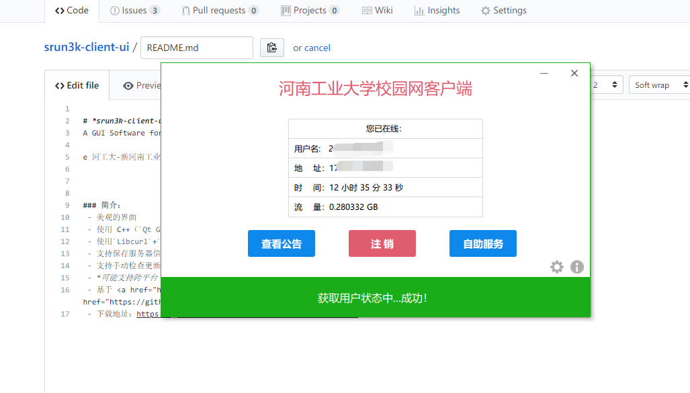

# *srun3k-client-ui*  
A GUI Software for Srun3k Client for HAUT 

e 河工大-新河南工业大学校园网PC客户端（Windows版） V2.0.0

-------

### 简介：
 - 美观的界面
 
 - 使用 C++（`Qt GUI `框架）制作
 
 - 使用`Libcurl`+`Openssl`完成网络相关动作
 
 - 支持保存服务器信息，用户信息
 
 - 支持手动检查更新
 
 - *可能支持跨平台（未测试）*
 
 - 基于 <a href="https://github.com/samuelts/srun3k-client/"><b>@samuelts </b></a> 和 <a href="https://github.com/noisky/srun3k-sb-client/"><b>@noisky </b></a> 网页版美化。
 
 - 下载地址：https://github.com/ehaut/srun3k-client-ui/releases
 
 
 ### LICENSE
 
 [MIT License](LICENSE)

 
 ### Contributing
 
 PR are welcome.
 
